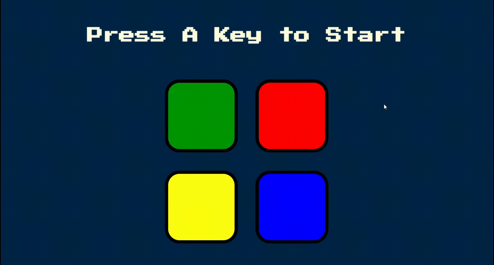

# Simon Game

The Simon Game is a classic memory game where players have to repeat a sequence of colors and sounds. This README provides an overview of the Simon Game and instructions on how to play it.

## Table of Contents

- [Game Overview](#game-overview)
- [Instructions](#instructions)
- [Features](#features)
- [Usage](#usage)
- [Contributing](#contributing)
- [License](#license)

## Game Overview

The Simon Game consists of a circular game console with four colored buttons: Red, Green, Blue, and Yellow. The console produces a sequence of tones and lights on the buttons. The player's task is to repeat the sequence by pressing the buttons in the correct order. The sequence gets longer and more complex as the game progresses.

## Instructions

1. Start the game by pressing the "any key on the keyboard.
2. The console will produce a sequence of tones and light up the corresponding buttons.
3. Pay close attention to the sequence.
4. After the sequence finishes, it's your turn to repeat it.
5. Click on the buttons in the same order as the sequence.
6. If you repeat the sequence correctly, the game continues with a longer sequence.
7. If you make a mistake, the game ends, and you can choose to play again.

## Features

- Simple and intuitive user interface.
- Auditory and visual cues for a better gaming experience.
- Progressive difficulty with longer and more complex sequences.
- Score tracking to keep track of your performance.
- Option to play again after completing or failing a game.

## Usage

Once you have the game running in your web browser, follow the instructions provided on the screen to play the Simon Game. Enjoy challenging your memory and trying to beat your high score!

## Contributing

Contributions are welcome! If you'd like to contribute to the project, please follow these steps:

Fork the repository.
Create a new branch.
Make your changes and commit them.
Push your changes to your forked repository.
Submit a pull request, describing the changes you made.

## License

This project is licensed under the [MIT](https://github.com/amaan14999/Simon-game/blob/main/LICENSE) License.
